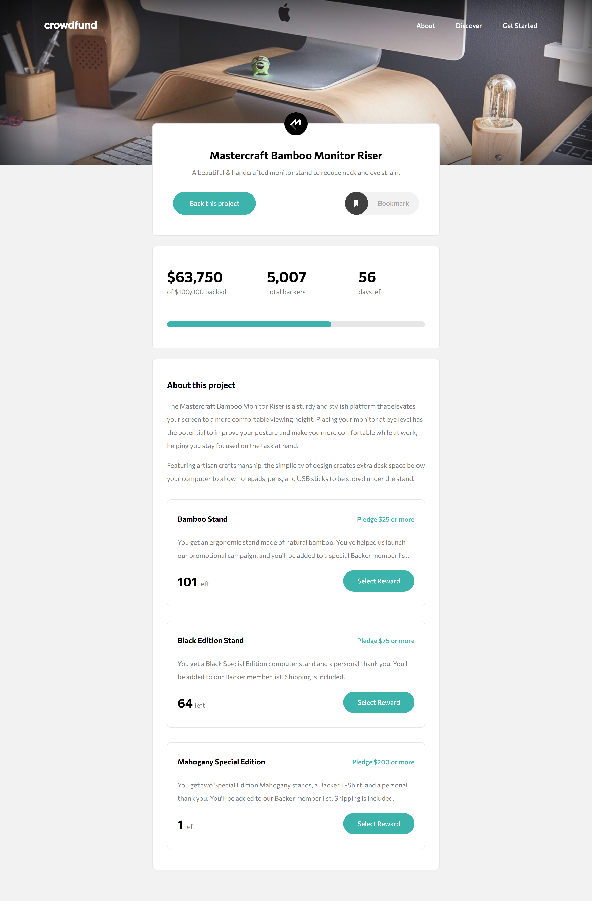

# Crowdfunding Product Page

This project was built using Frontend Mentor coding challenge assets, including JPEG design files for mobile & desktop layouts, style guide for fonts, colors, etc. and optimized image assets. The [challenge](https://www.frontendmentor.io/challenges/crowdfunding-product-page-7uvcZe7ZR) was to build a crowdfunding product page and match the original design as closely as possible.

## 📌 Pages

### Active Pages
- **Home**

## ⚙️ Built With

### Programming Languages

- **JavaScript:**
  High-level programming language for creating dynamic and interactive web environment.
- **HTML:**
  Markup language for defining and structuring web content.
- **CSS:**
  Stylesheet language for designing the website layout and appearance.

### Deployment

- **Netlify:**
  Development platform for deploying and hosting the website.

## 🚀 Live Demo

https://neon-peony-004ac7.netlify.app/

## 👉 Getting Started

   **1.** **Clone the repository** --> (git clone /repositoryURL/)

   **2.** **Install the Live Server extension** 

   **3.** **Start the Live Server** --> (
- In VS Code, click on "Go Live" button in the bottom status bar to launch the server.)

## Authors

👩🏻‍💻 Aleksandra Gjorchevska

- **GitHub:** https://github.com/alex-7-2

👩🏻‍💻 Sashka Janevska

- **GitHub:** https://github.com/sashkajanevska

## Show Your Support

Give a ⭐ if you like this project!
